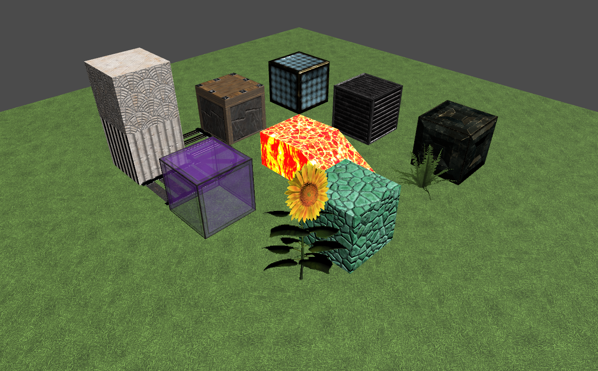
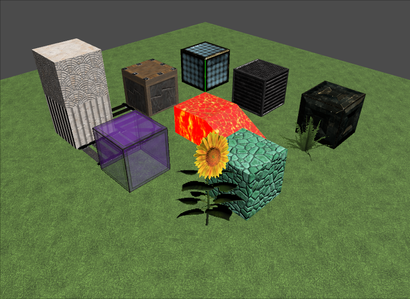

# McUsd Model

 renderer")
_McUsd: JG-RTX textures, rendered with Omniverse's Accurate (Iray) renderer_

Clockwise from "12 o'clock": diamond block, iron block, gold block, fern, prismarine, sunflower, purple stained glass, rails, chiseled quartz block atop quartz pillar, piston, and in the middle is lava.

_Note: here and further on, you can click on the image to see the full resolution version, which is scaled down to fit on this README page._

## Background

There are [serious efforts at compatibility test suites](https://developer.nvidia.com/blog/universal-scene-description-as-the-language-of-the-metaverse/) happening in the long-term in the USD community, e.g., see [this video](https://www.nvidia.com/en-us/on-demand/session/siggraph2022-sigg22-s-20/) at 23:09 on. This model is meant as a _simple_ test scene, now, with some interesting materials. The model is first and foremost meant as an aid in testing and debugging [the UsdPreviewSurface materials](https://graphics.pixar.com/usd/release/spec_usdpreviewsurface.html).

## Model Sources
This model was generated by laying down a few blocks in Classic (Java) Minecraft, then using [Mineways](http://mineways.com) to export the model to USDA format. The [JG-RTX resource pack](https://github.com/jasonjgardner/jg-rtx), released under the Creative Commons Attribution-ShareAlike 4.0 International Public License, is used at a resolution of 256x256 textures for the surfaces. Textures are of four possible types:
* Albedo/Opacity - sRGB color RGBA file with no suffix
* Normal - linear RGB vector directions in tangent space, mapped from (-1,-1,-1) to (1,1,1), suffix "_n.png"
* Roughness - grayscale roughness mapped to 0.0 (smooth) to 1.0 (rough), suffix "_r.png"
* Metallic - metalness, typically binary, mapped to 0.0 (non-metallic) to 1.0 (metallic), suffix "_m.png"
* Emissive - sRGB emissive color, suffix "_e.png"

### Technical Details
The [McUsd.usda file](McUsd.usda) is provided so that it is simple to examine the lights, camera, and model itself. As USD uses a film-industry specification, it is not obvious wha the camera's field of view is. The camera in McUsd has a field of view of 60 degrees horizontally, almost 36 degrees vertically.

Near the start of the file is the line:

    metersPerUnit = 1

By default USD uses centimeters as its units, i.e., the value is normally 0.01. Minecraft blocks are 1 meter "in real life", so this setting makes it so that all mesh descriptions are in meters. This looks cleaner and saves a lot of extraneous zeroes in the USDA file.

One element not fully specified for [the UsdPreviewSurface](https://graphics.pixar.com/usd/release/spec_usdpreviewsurface.html) is the full meaning of the "emissiveColor". As of October 2022 it is minimally specified as the "Emissive component." There are two questions that affect rendering: 1) how does an object with an emissive color appear when directly viewed? and 2) how does this emission color work with other lights?

For the first question, it is simple to say that the emissiveColor should be treated as a fixed color for the surface, the color that is always shown. However, USD has [an elaborate camera model](https://graphics.pixar.com/usd/dev/api/class_usd_geom_camera.html), including an exposure attribute, which implies that the appearance of the light should change as the exposure changes.

In McUsd a [nits interpretation](http://www.realtimerendering.com/blog/physical-units-for-lights/) is used for surfaces. The emissive texture is scaled up by 1000 (nits) by using the texture "scale" input:

    def Shader "emissive_texture"
    {
        float4 inputs:scale = (1000, 1000, 1000, 1)
    }

so that it gives off a reasonable amount of light to surrounding objects. This workaround is unlikely to be the standard way in the future. Also, this scaling factor can be applied only to textures, not colors.

This question of magnitude for lighting is part of a larger question, how physical lights are specified in USD. Currently [UsdLux](https://graphics.pixar.com/usd/release/api/usd_lux_page_front.html) and related light specifications use a film-related relative pair of values, ["exponent and intensity"](https://rmanwiki.pixar.com/display/REN23/PxrMeshLight), not tied to any physical units. All of these areas look to evolve to something providing a more physically based specification, which will help improve model interchange among applications.

#### Omniverse adjustments

In the McUsd.usda file are some render settings at the top that are specific to NVIDIA's Omniverse:

            double "rtx:post:tonemap:cameraShutter" = 10
            double "rtx:post:tonemap:filmIso" = 1000
            bool "rtx:raytracing:fractionalCutoutOpacity" = 1
            token "rtx:rendermode" = "PathTracing"
            double "rtx:sceneDb:ambientLightIntensity" = 0.0

Turning on the fractionalCutoffOpacity favors quality over speed for the Omniverse real-time renderer, providing better semitransparency. The fourth line specifies using an Omniverse path tracer on load. The last line turns off ambient lighting.

This leave the two camera exposure settings. This allows the emissive surfaces' effects to still be visible even with any scene being in full sun. The lighting intensity is 30 for the sun, 6 for the domeLight, with a more real-world 1000 (nits) for emissive surfaces. To compensate for the low sunlight and domeLight values, the camera is given higher exposure settings: 1/10th of a second shutter, 1000 ISO (and f-stop of 5.0, the default in Omniverse). If these two post:tonemap exposure settings are removed, the Sun should be set to an Intensity of about 1550, the DomeLight to 310, and the emissive surfaces (the two lava materials) should have inputs:scale to 53000 instead of 1000. This file is provided as McUsd_no_exposure.usda. This variant tends to blow out the appearance of lava even more in other applications, such as UsdView.

Please note that these settings are used as of October 2022, but their use and names in Omniverse may change over time.

## UsdView

Here is the rendering of McUsd inside UsdView:

_McUsd.usda, rendered with UsdView 0.22.8_

As expected from a basic rasterizer, shadows, reflections, and emitted light from surfaces are not rendered. By default, USDView adds a light "at the eye", which is shown in the rendering above. This additional light can be turned off via View -> Lights -> Camera Light. The DomeLight in McUsd appears to have no effect in UsdView, neither to direct illumination nor as a background environment map.

The lava light source seems oversaturated. As discussed above, the emissive texture is scaled up by a factor of 1000. Removing this scale factor, which is done in the file McUsd_unscaled_lava.usda, the lava looks more reasonable:

_McUsd_unscaled_lava.usda, rendered with UsdView 0.22.8_

## Variants
The list of variant models in this directory are:
* McUsd.usda - the main test file.
* McUsd_no_exposure.usda - as noted in "Omniverse adjustments" on the [main page](https://github.com/erich666/McUsd), render settings are included for NVIDIA's Omniverse that adjust the camera's default exposure. This variant file boosts all lights by a factor of about 53x and removes these camera exposure settings to give a comparable USD test file.
* McUsd_unscaled_lava.usda - the two emissive lava textures are not scaled up by 1000 in this version. This helps in testing whether the scale is affecting the display of the lava itself.

To see exact differences, perform a "diff" of any two USDA files.

---
## License

**[CC-NC-BY-SA](LICENSE)**

Textures from the [JG-RTX resource pack](https://github.com/jasonjgardner/jg-rtx), which has the same Creative Commons license.

---
# Contact
Email [me](http://erichaines.com) at [erich@acm.org](mailto:erich@acm.org).
