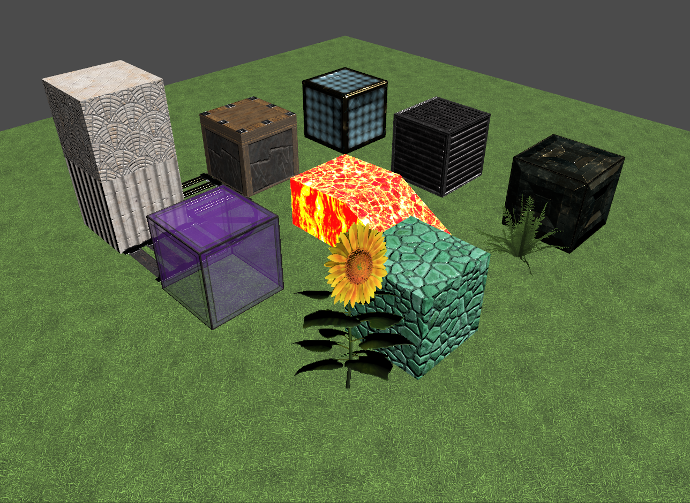

# McUsd Model

 renderer, 2022.3.1")

Clockwise from "12 o'clock": diamond block, iron block, gold block, fern, prismarine, sunflower, purple stained glass, rails, chiseled quartz block atop quartz pillar, piston, and in the middle is lava.

_Note: here and further on, you can click on the image to see the full resolution version, which may be scaled down to fit on this README page._

## Background

There are [serious efforts at compatibility test suites](https://developer.nvidia.com/blog/universal-scene-description-as-the-language-of-the-metaverse/) happening in the long-term in the USD community, e.g., see [this video](https://www.nvidia.com/en-us/on-demand/session/siggraph2022-sigg22-s-20/) at 23:09 on. This model is meant as a simple test scene with some interesting materials. The model is intended as an aid in testing and debugging various [UsdPreviewSurface 2.4 materials](https://graphics.pixar.com/usd/release/spec_usdpreviewsurface.html) and other USD features.

## Model Sources
This model was generated by laying down a few blocks in Classic (Java) Minecraft, then using [Mineways](http://mineways.com) to export the model to USDA format. The [JG-RTX resource pack](https://github.com/jasonjgardner/jg-rtx), released under the Creative Commons Attribution-ShareAlike 4.0 International Public License, is used at a resolution of 256x256 textures for the surfaces. Textures are of five possible types:
* Albedo/Opacity - sRGB color RGBA file with no suffix to the root file name, e.g., "dirt.png"
* Normal - linear RGB vector directions in tangent space, mapped from (-1,-1,-1) to (1,1,1), suffix "_n.png"
* Roughness - grayscale roughness mapped to 0.0 (smooth) to 1.0 (rough), suffix "_r.png"
* Metallic - metalness, typically binary, mapped to 0.0 (non-metallic) to 1.0 (metallic), suffix "_m.png"
* Emissive - sRGB emissive color, suffix "_e.png"

### Technical Details
The [McUsd.usda file](McUsd.usda) is provided so that it is simple to examine the lights, camera, and model itself. As USD uses a film-industry specification, it is not obvious wha the camera's field of view is. The camera in McUsd has a field of view of 60 degrees horizontally, almost 36 degrees vertically.

Near the start of the file is the line:

    double3 xformOp:scale = (100.000000, 100.000000, 100.000000)

By default USD uses centimeters as its units. Minecraft blocks are 1 meter "in real life", so this scale setting makes it so that the meshes are properly meters. Doing so saves having a lot of zeroes in the USDA file. Note that the USD ["metersPerUnit"](https://graphics.pixar.com/usd/dev/api/group___usd_geom_linear_units__group.html) could have been set from the default of 0.01 to 1, but doing so can lead to [a camera specification issue](https://github.com/erich666/McUsd/issues/3).

One element not fully specified for [the UsdPreviewSurface material](https://graphics.pixar.com/usd/release/spec_usdpreviewsurface.html) is the full meaning of the "emissiveColor". As of Version 2.4 it is minimally specified as the "Emissive component." There are two questions that affect rendering: 1) how does an object with an emissive color appear when directly viewed? and 2) how does this emission color work with other lights?

For the first question, one idea is to say that the emissiveColor should be treated as a fixed color for the surface, the color that is always shown. However, USD has [an elaborate camera model](https://graphics.pixar.com/usd/dev/api/class_usd_geom_camera.html), including an exposure attribute, which implies that the appearance of the light should change as the exposure changes.

For both questions, in McUsd the emissive lava_still and lava_flow textures are scaled by a factor of 20:

    def Shader "emissive_texture"
    {
        float4 inputs:scale = (20, 20, 20, 1.0)
    }

so that it gives off a reasonable amount of light to surrounding objects when viewed in NVIDIA's Omniverse. This scale factor may need to be rescaled for other applications, and may need modification in the future depending on how the specification evolves. Also, note this scaling factor can be applied only to textures, not colors.

This area of lighting is part of a larger question, how physical lights are specified in USD. Currently [UsdLux](https://graphics.pixar.com/usd/release/api/usd_lux_page_front.html) and related light specifications use a film-related relative pair of values, ["exponent and intensity"](https://rmanwiki.pixar.com/display/REN23/PxrMeshLight), not tied to any physical units. All of these areas look to evolve to something providing a more physically based specification, which will help improve model interchange among applications.

#### Omniverse adjustments

In the McUsd.usda file are some render settings at the top that are specific to NVIDIA's Omniverse:

    bool "rtx:raytracing:fractionalCutoutOpacity" = 1
    token "rtx:rendermode" = "PathTracing"
    float3 "rtx:sceneDb:ambientLightColor" = (0, 0, 0)

Turning on the fractionalCutoffOpacity favors quality over speed for the Omniverse real-time renderer, providing better rendering for glass and other semitransparent objects. The second line specifies using an Omniverse path tracer on load. The last line turns off Omniverse's ambient lighting.

These render settings are used in Omniverse as of December 2022, but their use and names may change over time.

## USDView

Load procedure: File -> Open and select McUsd.usda. Press F11 to toggle on the hierarchy view (if not already visible). Open the "root" by double-clicking on it. Select the "Camera" and right-click, then pick (at the bottom) "Set As Active Camera".

Here is the rendering of McUsd inside USDView, using [NVIDIA's prebuilt version 0.23.2](https://www.nvidia.com/en-us/omniverse/):

As expected from a basic rasterizer, shadows, reflections, and emitted light from surfaces are not rendered. By default, USDView adds a light "at the eye", which is shown in the rendering above. This additional light can be turned off via the viewport's Lights -> Enable Default Camera Light. The DomeLight in McUsd appears to have no effect in USDView, neither to direct illumination nor as a background environment map.

## Variants
The list of variant models in this directory are:
* McUsd.usda - the main test file.
* McUsd_10cm.usda - instead of making the blocks 1 meter wide, make each 10 cm wide, by changing the scale factor.

To see exact differences, perform a "diff" of the USDA files.

---
## License

**[CC-NC-BY-SA](LICENSE)**

Textures from the [JG-RTX resource pack](https://github.com/jasonjgardner/jg-rtx), which has the same Creative Commons license.

---
# Contact
Email [me](http://erichaines.com) at [erich@acm.org](mailto:erich@acm.org).
